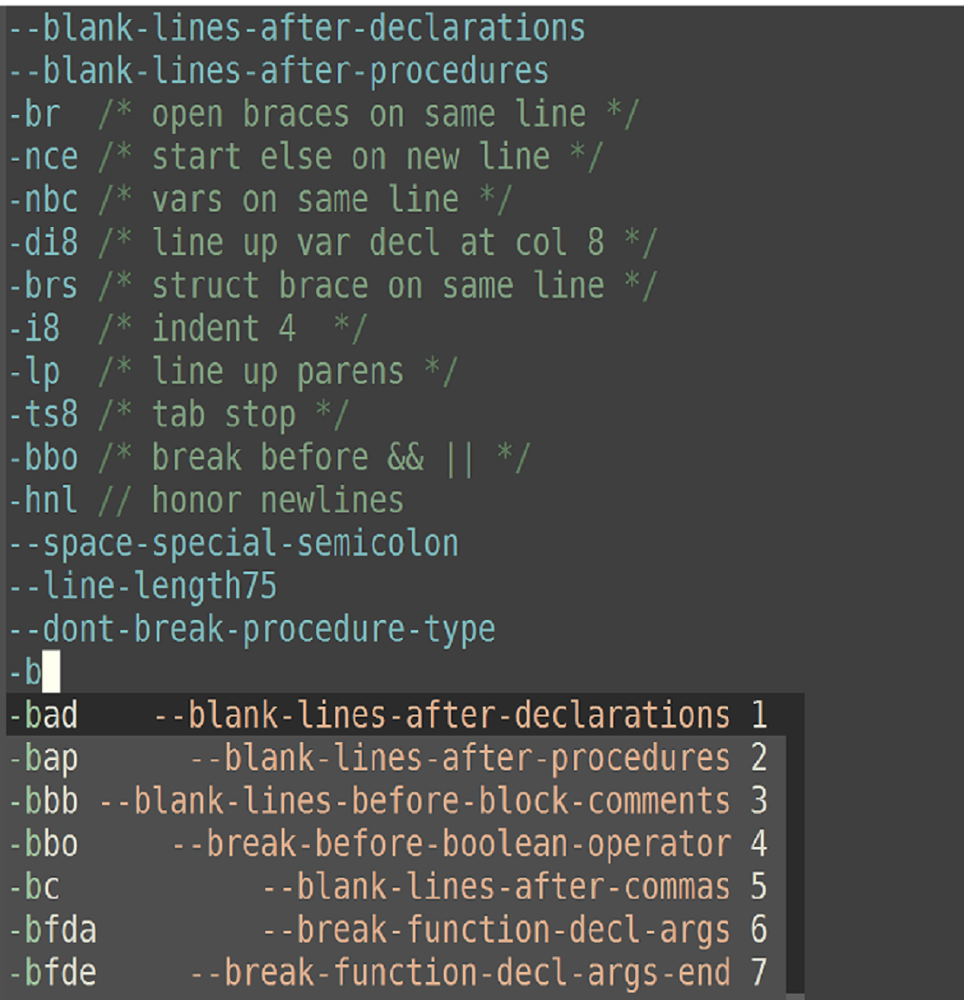

*Author:* Noah Peart <noah.v.peart@gmail.com><br>
*URL:* [https://github.com/nverno/company-indentpro](https://github.com/nverno/company-indentpro)<br>

Description:

Completion support (`company-mode`) backend for .indent.pro files.

Provides:

+ meta information for command options
+ annotation showing long options for short options and vice versa
+ support for `company-doc` (ie ~C-h~ in company completion).

Installation:

See [indentpro-mode](https://github.com/nverno/indentpro-mode) for
simple accompanying major mode.

Install `company-mode` and add this file to `load-path`.
Then either compile/create autoloads and load autoloads files,
or require the file in your init file:

```lisp
(require 'company-indentpro-mode) ; or autoload

;; Either set `indentpro-use-company` or add a custom hook,
;; For example:
 
(add-hook 'indentpro-mode-hook
          #'(lambda ()
              (set (make-local-variable 'company-backends)
                   '((company-indentpro company-dabbrev-code)
                      company-dabbrev))))
```

Example:




---
Converted from `company-indentpro.el` by [*el2markdown*](https://github.com/Lindydancer/el2markdown).
